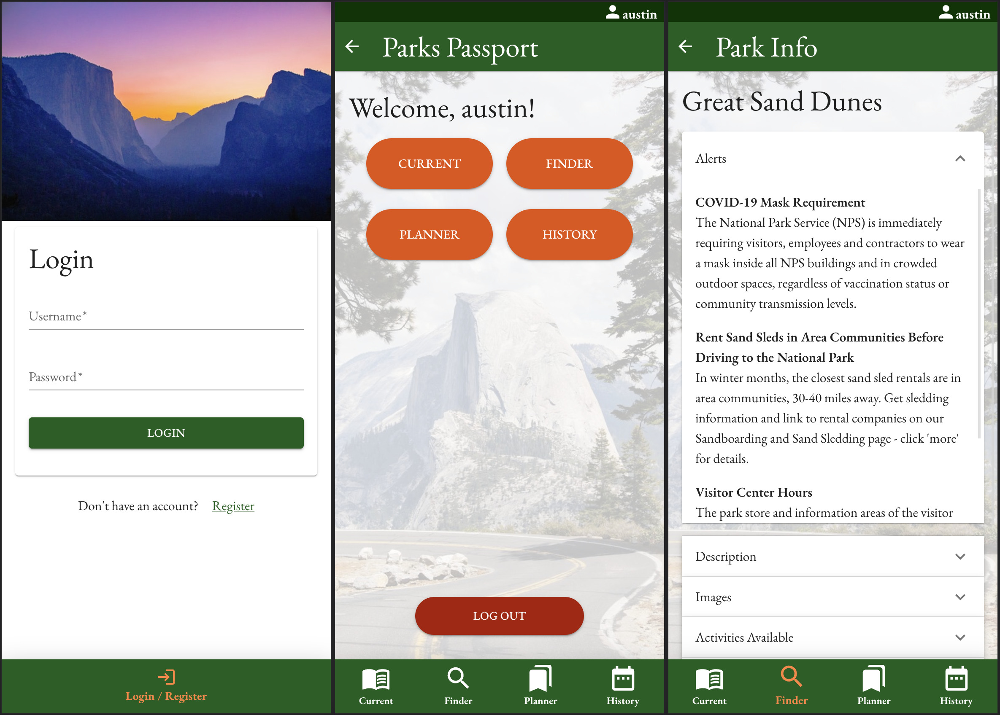

   

# Parks Passport

## Table of Contents

- [Description](#description)
- [Screenshots](#screenshots)
- [Built With](#built-with)
- [Getting Started](#getting-started)
  - [Prerequisites](#prerequisites)
  - [Installation](#installation)
- [Usage](#usage)
- [License](#license)
- [Acknowledgements](#acknowledgements)
- [Contacts](#contacts)

## Description

Parks Passport is a mobile-styled React app for planning and recording trips to US National Parks. It seeks to provide an easy way to gather valuable park information for planning a trip as well as to organize users' memories made and photos taken during their visits. It utilizes the National Park Service's API to provide information and images for every national park, preserve monument, historic area, etc. in the United States. It also uses multer and AWS S3 to upload and store user photos in the cloud.

The app allows users to search for National Parks by state and view select information about them for planning purposes. Parks may then be added to their Planner to start a list of parks the user wishes to visit. During visits, users may then upload photos and text entries in their Trip Log. Users may also look back on their past trips to view any photos text entries made at a particular park.

The deployed version of the app may be found [here](https://sheltered-retreat-52105.herokuapp.com/)

TODO:
[] Responsive Layout
[] Add personal travel and visitation statistics to User page
[] Implement profile pictures
[] Allows users to view other users' current and past Trip Logs

## Screenshots

## Built With

## Getting Started

In order to replicate the project, you will need an [AWS account](https://aws.amazon.com/) with an S3 bucket with a corresponding User and Policy. You will also need an [API key](https://www.nps.gov/subjects/developer/get-started.htm) from the National Park Service.

### Prerequisites

Node.js
PostgreSQL
AWS S3 bucket
NPS API key

### Installation

1. Create a database named `prime_app`,
2. The queries in the `database.sql` file are set up to create the necessary tables, functions and triggers. [Postico](https://eggerapps.at/postico/) is recommended as that was used to create the queries
3. Open up your editor of choice and run `npm install`
4. Create a file named `.env` with the following variables (values are examples):
   `SERVER_SESSION_SECRET = SUPERSECRETUNIQESTRING`
   `NPS_API_KEY = asdf22sf34hbYOURNPSAPIKEY`
   `AWS_BUCKET_NAME="name-of-your-bucket"`
   `AWS_BUCKET_REGION="bucket-region"`
   `AWS_ACCESS_KEY="ADKSIEO12JNC9HEXAMPLE"`
   `AWS_SECRET_KEY="abcdefghijklmnopqrstuvwxyz/123456EXAMPLE"`
5. Run `npm run server` in your terminal to start the server with `nodemon`
6. Run `npm run client` in your terminal to open the client in your browser
7. Reduce window width to 400 pixels for optimal appearance

## Usage

#### Authentication

- Login or register as a new user.

#### Finder

- To search for parks, use the navigation bar to visit the 'Finder'. Select the desired state and click 'Search'. If you would like to only see National Park results, toggle the 'National Parks only' switch.
- Click on a result's image to view Park Info page for that location.
- Search results may be added to you your Planner with the 'Add' button. Alternatively, you may immediately start a Trip Log with the 'Start' button.

#### Planner

- Navigate to your 'Planner' to view the parks and locations you've added. The Park Info page for each park or location may again be viewed by clicking its image.
- Parks and locations may be removed from your Planner with the trashcan button. Start a Trip Log for it with the 'Start' button.

#### Trip Log

- Navigate to your current Trip Log using 'Current' on the navigation bar. This is where you will make log entries during a visit to a particular park.
- Use the '+' action button to pull up the log entry form. Here, you may enter a text entry, upload a photo, or both.
- Entries may be edited with the 'pencil' button and deleted with the 'trashcan' button.
- Park Info for the park may again be viewed using the 'Park Info' button.
- To close your Trip Log for this visit, use the 'End Trip' button to move it to your History.

#### History

- Navigate to your 'History' using the navigation bar. This is where you may view the Trip Logs for your previous visits.
- Entries may again be added, edited, and deleted.

#### User

- Navigate to your User page by clicking your username in the top right of the view
- Log out using the 'Log Out" button.

## Acknowledgements

I would like to thank [Prime Digital Academy](www.primeacademy.io), [Dane Smith](https://github.com/DoctorHowser), and [Kris Szafranski](https://github.com/kdszafranski)

## Contacts

Please don't hesitate to reach out with suggestions, questions, or anything else.

 
